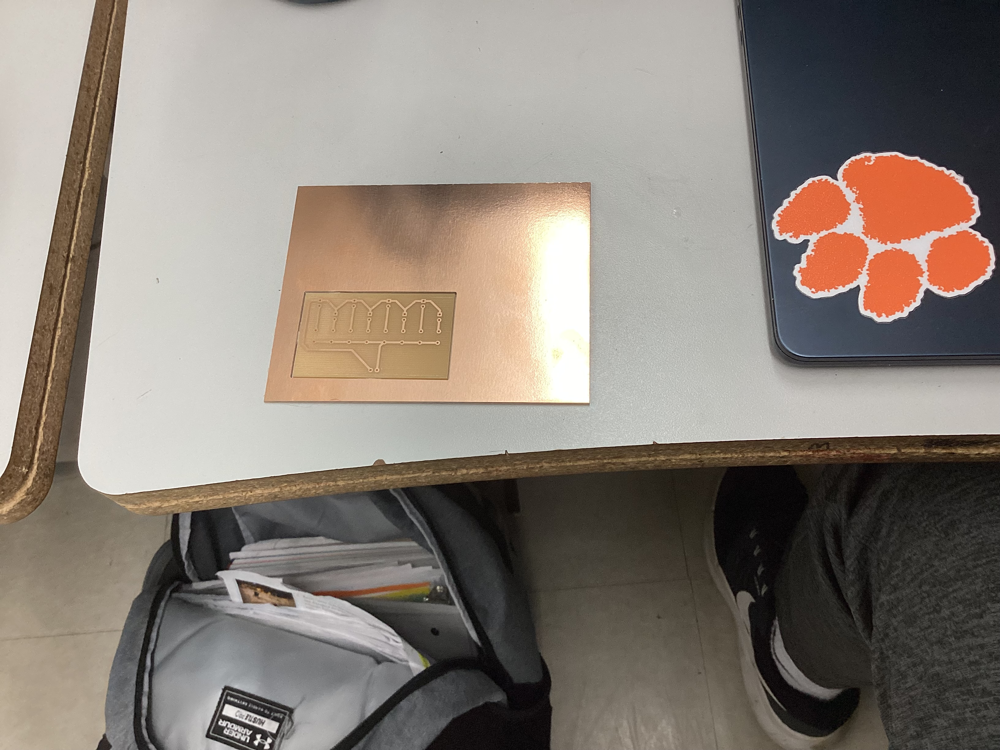
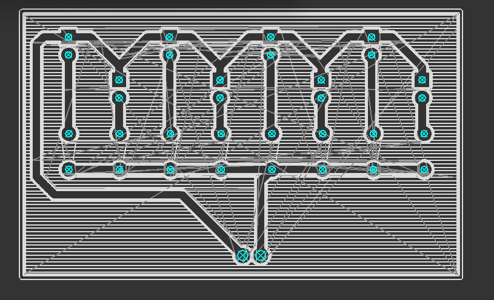

This is my digital portfolio for my PCB Board

Design 

Workflows:  

Challenges: Making my PCB board and milling it was a new thing for me. My first issue was in the creation of the document. I was not very good at selecting the right lines for my 2-d pocket. Bu with enough b=practice attempts, I was able to see the lines I needed and select them. I also had trouble using the software to print. While I was able to learn, this was agian a new software.
